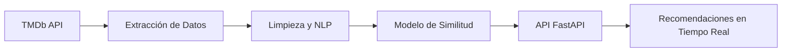

# 🎬 Sistema de Recomendación de Películas con NLP


Un sistema inteligente que recomienda películas basado en análisis de reseñas utilizando **Procesamiento de Lenguaje Natural** y algoritmos de similitud. ¡Descubre tu próxima película favorita!

🌐 **API en vivo**: [Desplegado en Render](https://mvp-sistema-recomendacion.onrender.com)

## 🚀 Características Destacadas

- **Recomendaciones Personalizadas**: Obtén sugerencias basadas en similitud semántica de reseñas.

- **Pipeline de Datos Integrado**: Extracción, limpieza y transformación automatizada de datos de TMDb.

- **Visualizaciones Interesantes**: Insights sobre géneros, puntuaciones y tendencias cinematográficas.

- **API RESTful**: Interfaz moderna con documentación Swagger integrada.

## 🧠 Arquitectura del Sistema



## 📦 Tecnologías Clave

| Categoría          | Herramientas                                                                 |

|---------------------|------------------------------------------------------------------------------|

| **Lenguaje**        | Python 3.11                                                                 |

| **API Framework**   | FastAPI, Uvicorn                                                            |

| **NLP**             | spaCy, NLTK, TF-IDF                                                         |

| **Data Science**    | Pandas, Scikit-learn, NumPy                                                 |

| **Visualización**   | Matplotlib, Seaborn, WordCloud                                              |

| **Despliegue**      | Render, Docker                                                              |

## 🛠️ Instalación Rápida

1. **Clonar repositorio**

```bash

git clone https://github.com/JuliaGastellu/MVP_sistema_recomendacion.git

cd MVP_sistema_recomendacion

```

2. **Configurar entorno virtual**

```bash

python -m venv .venv

source .venv/bin/activate  # Linux/Mac

.venv\Scripts\activate     # Windows

```

3. **Instalar dependencias**

```bash

pip install -r requirements.txt

python -m spacy download es_core_news_sm

```

4. **Configurar API Key**

```bash

echo "TMDB_API_KEY=tu_clave_aqui" > .env

```

## 💻 Uso del Sistema

### ▶️ Iniciar la API

```bash

uvicorn app:app --reload

```

Visita la documentación interactiva: http://localhost:8000/docs

### 🔍 Ejemplo de Consulta

```python

import requests

response = requests.get("http://localhost:8000/recomendacion/Inception")

print(response.json())

```

**Salida Esperada:**

```json

{

"pelicula_consultada": "Inception",

"recomendaciones": [

"The Matrix",

"Interstellar",

"The Prestige",

"Memento",

"Tenet"

]

}

```

## 🤝 Cómo Contribuir

1. Haz fork del proyecto

2. Crea tu feature branch (`git checkout -b feature/nueva-funcionalidad`)

3. Realiza tus cambios

4. Haz commit (`git commit -am 'Add nueva funcionalidad'`)

5. Push a la rama (`git push origin feature/nueva-funcionalidad`)

6. Abre un Pull Request


## ✒️ Autora

**Julia Gastellu**

[](https://linkedin.com/in/juliagastellu)

---

⭐ ¿Te gusta el proyecto? Dale una estrella en GitHub para apoyar su desarrollo!


