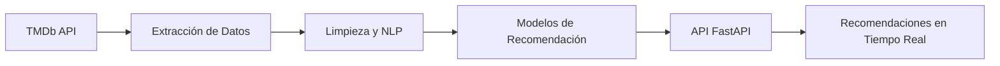

# 🎬 Sistema de Recomendación de Películas con NLP – Similitud Semántica y TF-IDF en FastAPI


Un sistema inteligente que recomienda películas basado en análisis de reseñas utilizando **Procesamiento de Lenguaje Natural** y algoritmos de similitud. ¡Descubre tu próxima película favorita!

🌐 **API en vivo**: [Desplegado en Render](https://mvp-sistema-recomendacion.onrender.com/docs)

## 🚀 Características Destacadas

- **Recomendaciones Personalizadas**: Obtén sugerencias basadas en similitud semántica de reseñas y géneros.
- **Pipeline de Datos Integrado**: Extracción, limpieza y transformación de datos directamente desde la api de TMDb.
- **Visualizaciones Interesantes**: Insights sobre géneros, puntuaciones y tendencias cinematográficas.
- **API RESTful**: Interfaz moderna con documentación Swagger integrada.

## 🧠 Arquitectura del Sistema



## 📖 Descripción del Modelo

El sistema implementa dos enfoques complementarios de recomendación basados en **Procesamiento de Lenguaje Natural (NLP)**:

1. **Modelo basado en TF-IDF y Similitud de Coseno**
   - Se procesan las reseñas de los usuarios aplicando **TF-IDF** para extraer términos relevantes.
   - Se calcula la **similitud de coseno** entre películas para identificar aquellas con descripciones y reseñas similares.
   - Este enfoque es útil cuando se busca encontrar recomendaciones basadas en el contenido textual de las películas.

2. **Modelo basado en Embeddings de Sentence Transformers**
   - Se utiliza el modelo `all-MiniLM-L6-v2` de **Sentence Transformers** para representar semánticamente los géneros de las películas.
   - Se calculan vectores representativos de los géneros y se compara la similitud utilizando **cosine similarity**.
   - Este método permite ofrecer recomendaciones basadas en el contexto de los géneros cinematográficos.

Ambos modelos se exponen mediante endpoints independientes dentro de la API, permitiendo a los usuarios seleccionar el tipo de recomendación más adecuado según sus necesidades.

## 📦 Tecnologías Clave

| Categoría          | Herramientas                                                                 |

|---------------------|------------------------------------------------------------------------------|

| **Lenguaje**        | Python 3.11                                                                 |

| **API Framework**   | FastAPI, Uvicorn                                                            |

| **NLP**             | spaCy, NLTK, TF-IDF, Sentence Transformers                                  |

| **Data Science**    | Pandas, Scikit-learn, NumPy                                                 |

| **Visualización**   | Matplotlib, Seaborn, WordCloud                                              |

| **Despliegue**      | Render                                                           |

## 🛠️ Instalación Rápida

1. **Clonar repositorio**

```bash

git clone https://github.com/JuliaGastellu/MVP_sistema_recomendacion.git

cd MVP_sistema_recomendacion

```

2. **Configurar entorno virtual**

```bash

python -m venv .venv

source .venv/bin/activate  # Linux/Mac

.venv\Scripts\activate     # Windows

```

3. **Instalar dependencias**

```bash

pip install -r requirements.txt

python -m spacy download es_core_news_sm

```

4. **Configurar API Key**

```bash

echo "TMDB_API_KEY=tu_clave_aqui" > .env

```

## 💻 Uso del Sistema

### ▶️ Iniciar la API

```bash

uvicorn app:app --reload

```

### 🔍 Ejemplo de Consulta

#### Recomendaciones basadas en reseñas (TF-IDF + Cosine Similarity)


```python
response = requests.get("http://localhost:8000/recomendacion/reseñas/Origen")

print(response.json())

```

**Salida Esperada:**

{
  "pelicula_consultada": "Origen",
  "recomendaciones": [
    {
      "titulo": "Oppenheimer",
      "sinopsis": "Película sobre el físico J. Robert Oppenheimer y su papel como desarrollador de la bomba atómica. Basada en el libro 'American Prometheus: The Triumph and Tragedy of J. Robert Oppenheimer' de Kai Bird y Martin J. Sherwin.",
      "puntuacion": 8.068
    },
    {
      "titulo": "Godzilla y Kong: El nuevo imperio",
      "sinopsis": "Una aventura cinematográfica completamente nueva, que enfrentará al todopoderoso Kong y al temible Godzilla contra una colosal amenaza desconocida escondida dentro de nuestro mundo. La nueva y épica película profundizará en las historias de estos titanes, sus orígenes y los misterios de Isla Calavera y más allá, mientras descubre la batalla mítica que ayudó a forjar a estos seres extraordinarios y los unió a la humanidad para siempre.",
      "puntuacion": 7.101
    },
    {
      "titulo": "Piratas del Caribe: La maldición de la Perla Negra",
      "sinopsis": "El aventurero capitán Jack Sparrow recorre las aguas caribeñas. Pero su andanzas terminan cuando su enemigo, el capitán Barbossa le roba su barco, la Perla Negra, y ataca la ciudad de Port Royal, secuestrando a Elizabeth Swann, hija del gobernador. Will Turner, el amigo de la infancia de Elizabeth, se une a Jack para rescatarla y recuperar la Perla Negra. Pero el prometido de Elizabeth, comodoro Norrington, les persigue a bordo del HMS Impávido. Además, Barbossa y su tripulación son víctimas de un conjuro por el que están condenados a vivir eternamente, y a transformarse cada noche en esqueletos vivientes, en fantasmas guerreros.",
      "puntuacion": 7.808
    },
    {
      "titulo": "Top Gun: Maverick",
      "sinopsis": "Después de más de 30 años de servicio como uno de los mejores aviadores de la Armada, Pete \"Maverick\" Mitchell se encuentra dónde siempre quiso estar, empujando los límites como un valiente piloto de prueba y esquivando el alcance en su rango, que no le dejaría volar emplazándolo en tierra. Cuando se encuentra entrenando a un destacamento de graduados de Top Gun para una misión especializada, Maverick se encuentra allí con el teniente Bradley Bradshaw, el hijo de su difunto amigo \"Goose\".",
      "puntuacion": 8.183
    },
    {
      "titulo": "Parásitos",
      "sinopsis": "Tanto Gi Taek (Song Kang-ho) como su familia están sin trabajo. Cuando su hijo mayor, Gi Woo (Choi Woo-sik), empieza a dar clases particulares en casa de Park (Lee Seon-gyun), las dos familias, que tienen mucho en común pese a pertenecer a dos mundos totalmente distintos, comienzan una interrelación de resultados imprevisibles.",
      "puntuacion": 8.501
    }
  ]
}

#### Recomendación basada en géneros (Sistema de recomendación por géneros)

```python
response = requests.get("http://localhost:8000/recomendacion/generos/Origen")

print(response.json())

```

**Salida Esperada:**

{
  "pelicula_consultada": "Origen",
  "recomendaciones": [
    {
      "titulo": "El señor de los anillos: La comunidad del anillo",
      "generos": "",
      "sinopsis": "En la Tierra Media, el Señor Oscuro Saurón creó los Grandes Anillos de Poder, forjados por los herreros Elfos. Tres para los reyes Elfos, siete para los Señores Enanos, y nueve para los Hombres Mortales. Secretamente, Saurón también forjó un anillo maestro, el Anillo Único, que contiene en sí el poder para esclavizar a toda la Tierra Media. Con la ayuda de un grupo de amigos y de valientes aliados, Frodo emprende un peligroso viaje con la misión de destruir el Anillo Único. Pero el Señor Oscuro Sauron, quien creara el Anillo, envía a sus servidores para perseguir al grupo. Si Sauron lograra recuperar el Anillo, sería el final de la Tierra Media.",
      "puntuacion": 8.418
    },
    {
      "titulo": "Origen",
      "generos": "",
      "sinopsis": "Dom Cobb es un ladrón hábil, el mejor de todos, especializado en el peligroso arte de extracción: el robo de secretos valiosos desde las profundidades del subconsciente durante el estado de sueño cuando la mente está más vulnerable. Esta habilidad excepcional de Cobb le ha hecho un jugador codiciado en el traicionero nuevo mundo de espionaje corporativo, pero al mismo tiempo, le ha convertido en un fugitivo internacional y ha tenido que sacrificar todo que le importaba. Ahora a Cobb se le ofrece una oportunidad para redimirse. Con un último trabajo podría recuperar su vida anterior, pero solamente si logra lo imposible.",
      "puntuacion": 8.369
    },
    {
      "titulo": "Transformers: El despertar de las bestias",
      "generos": "",
      "sinopsis": "Cuando surge una nueva amenaza capaz de destruir todo el planeta, Optimus Prime y los Autobots deben unirse a una poderosa facción conocida como los Maximals. Con el destino de la humanidad en juego, los humanos Noah y Elena harán lo que sea necesario para ayudar a los Transformers mientras se involucran en la batalla final para salvar la Tierra.",
      "puntuacion": 7.246
    },
    {
      "titulo": "Contraataque",
      "generos": "",
      "sinopsis": "En una misión de rescate de rehenes, el capitán Guerrero y sus soldados de élite sufren una emboscada de un despiadado cártel de la droga.",
      "puntuacion": 8.496
    },
    {
      "titulo": "El abismo secreto",
      "generos": "",
      "sinopsis": "Dos agentes de élite son secretamente asignados a torres de vigilancia en los lados opuestos de un vasto desfiladero, para proteger al mundo de un misterioso mal que acecha en su interior. Se unen en la distancia, pero han de mantenerse alerta para defenderse del enemigo invisible. Cuando se les revela una amenaza fatal para la humanidad, deben trabajar juntos y poner a prueba su fuerza física y mental para mantener el secreto del desfiladero antes de que sea demasiado tarde.",
      "puntuacion": 7.747
    }
  ]
}


## 🤝 Cómo Contribuir

1. Haz fork del proyecto
2. Crea tu feature branch (`git checkout -b feature/nueva-funcionalidad`)
3. Realiza tus cambios
4. Haz commit (`git commit -am 'Add nueva funcionalidad'`)
5. Push a la rama (`git push origin feature/nueva-funcionalidad`)
6. Abre un Pull Request

## ✒️ Autora

**Julia Gastellu**

[](https://linkedin.com/in/juliagastellu)

---

⭐ ¿Te gusta el proyecto? Dale una estrella en GitHub para apoyar su desarrollo!
