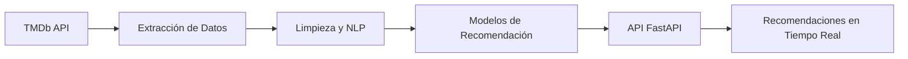

# 🎬 Sistema de Recomendación de Películas con NLP – Similitud Semántica y TF-IDF en FastAPI


Un sistema inteligente que recomienda películas basado en análisis de reseñas utilizando **Procesamiento de Lenguaje Natural** y algoritmos de similitud. ¡Descubre tu próxima película favorita!

🌐 **API en vivo**: [Desplegado en Render](https://mvp-sistema-recomendacion.onrender.com/docs)

## 🚀 Características Destacadas

- **Recomendaciones Personalizadas**: Obtén sugerencias basadas en similitud semántica de reseñas y géneros.
- **Pipeline de Datos Integrado**: Extracción, limpieza y transformación de datos directamente desde la api de TMDb.
- **Visualizaciones Interesantes**: Insights sobre géneros, puntuaciones y tendencias cinematográficas.
- **API RESTful**: Interfaz moderna con documentación Swagger integrada.
- **Arquitectura Modular**: Estructura de código organizada y mantenible.
- **Sistema de Logging**: Monitoreo detallado de la aplicación.
- **Manejo de Errores Robusto**: Respuestas claras y descriptivas ante problemas.

## 🧠 Arquitectura del Sistema



## 📖 Descripción del Modelo

El sistema implementa dos enfoques complementarios de recomendación basados en **Procesamiento de Lenguaje Natural (NLP)**:

1. **Modelo basado en TF-IDF y Similitud de Coseno**
   - Se procesan las reseñas de los usuarios aplicando **TF-IDF** para extraer términos relevantes.
   - Se calcula la **similitud de coseno** entre películas para identificar aquellas con descripciones y reseñas similares.
   - Este enfoque es útil cuando se busca encontrar recomendaciones basadas en el contenido textual de las películas.

2. **Modelo basado en Embeddings de Sentence Transformers**
   - Se utiliza el modelo `all-MiniLM-L6-v2` de **Sentence Transformers** para representar semánticamente los géneros de las películas.
   - Se calculan vectores representativos de los géneros y se compara la similitud utilizando **cosine similarity**.
   - Este método permite ofrecer recomendaciones basadas en el contexto de los géneros cinematográficos.

Ambos modelos se exponen mediante endpoints independientes dentro de la API, permitiendo a los usuarios seleccionar el tipo de recomendación más adecuado según sus necesidades.

## 📦 Tecnologías Clave

| Categoría          | Herramientas                                                                 |
|---------------------|------------------------------------------------------------------------------|
| **Lenguaje**        | Python 3.11                                                                 |
| **API Framework**   | FastAPI, Uvicorn                                                            |
| **NLP**             | spaCy, NLTK, TF-IDF, Sentence Transformers                                  |
| **Data Science**    | Pandas, Scikit-learn, NumPy                                                 |
| **Visualización**   | Matplotlib, Seaborn, WordCloud                                              |
| **Despliegue**      | Render                                                           |
| **Configuración**   | Pydantic Settings, Python-dotenv                                           |

## 🏗️ Estructura del Proyecto

```
├── proyecto/
│   ├── data/
│   │   ├── movies.parquet
│   │   └── movies_filtrado.parquet
│   ├── images/
│   │   ├── endpoint1.png
│   │   └── endpoint2.png
│   ├── models/
│   │   ├── hybrid_model.py
│   │   ├── sentence_transformer_model.py
│   │   └── tfidf_model.py
│   └── notebooks/
│       ├── EDA.ipynb
│       ├── ETL.ipynb
│       ├── TF-IDF-Cosine-Sim_model.ipynb
│       └── all-MiniLM-L6-v2_model.ipynb
├── README.md
├── main.py
├── requirements.txt
└── .gitignore
```

## 🛠️ Instalación Rápida

1. **Clonar repositorio**
```bash
git clone https://github.com/JuliaGastellu/MVP_sistema_recomendacion.git
cd MVP_sistema_recomendacion
```

2. **Configurar entorno virtual**
```bash
python -m venv .venv
source .venv/bin/activate  # Linux/Mac
.venv\Scripts\activate     # Windows
```

3. **Instalar dependencias**
```bash
pip install -r requirements.txt
python -m spacy download es_core_news_sm
```

4. **Configurar variables de entorno**
```bash
# El archivo .env ya está configurado con valores predeterminados
# Puedes modificarlo según tus necesidades
```

## 💻 Uso del Sistema

### ▶️ Iniciar la API
```bash
uvicorn app.main:app --reload
```

### 🔍 Ejemplo de Consulta

#### Recomendaciones basadas en reseñas (TF-IDF + Cosine Similarity)
```python
response = requests.get("http://localhost:8000/api/v1/recomendacion/Origen")
print(response.json())
```

**Salida Esperada:**


#### Recomendación basada en géneros (Sistema de recomendación por géneros)
```python
response = requests.get("http://localhost:8000/api/v1/recomendacion_genero/Origen")
print(response.json())
```

**Salida Esperada:**


## 🔍 Monitoreo y Logging

El sistema implementa un sistema de logging detallado que permite:

- Rastrear el flujo de ejecución de la aplicación
- Identificar errores y excepciones
- Monitorear el rendimiento de los endpoints
- Facilitar la depuración de problemas

Los logs se configuran con el siguiente formato:
```
%(asctime)s - %(name)s - %(levelname)s - %(message)s
```

## 🤝 Cómo Contribuir

1. Haz fork del proyecto
2. Crea tu feature branch (`git checkout -b feature/nueva-funcionalidad`)
3. Realiza tus cambios
4. Haz commit (`git commit -am 'Add nueva funcionalidad'`)
5. Push a la rama (`git push origin feature/nueva-funcionalidad`)
6. Abre un Pull Request

## ✒️ Autora

**Julia Gastellu**

[](https://linkedin.com/in/juliagastellu)

---

⭐ ¿Te gusta el proyecto? Dale una estrella en GitHub para apoyar su desarrollo! 